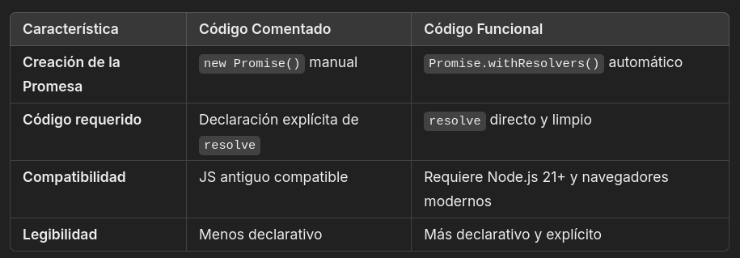

## PERFORMANCE-BENCHMARK
## PromiseExplorer 🚀
Un proyecto que compara y explora enfoques modernos y tradicionales para manejar Promesas en JavaScript, incluyendo su integración con Web Workers para tareas en segundo plano multihilo.
App para revisar el rendimiento de tu código JavaScript

##  Características 🌟
Creación de Promesas: Comparación entre `new Promise()` y `Promise.withResolvers()`.
Uso de Workers: Ejecución eficiente de tareas asíncronas con Web Workers.
Código Moderno vs Antiguo: Evaluación de compatibilidad y legibilidad.
Ejemplos Prácticos: Implementaciones claras de ambos enfoques.

## Diferencias clave 📊

## Uso de Web Workers 🛠️
Los Web Workers permiten ejecutar operaciones costosas en segundo plano sin bloquear la interfaz de usuario.

## Conclusión 🎯
Este proyecto demuestra cómo combinar Promesas con Web Workers para manejar tareas asíncronas de manera más eficiente y optimizada, mejorando el rendimiento de aplicaciones JavaScript modernas.
